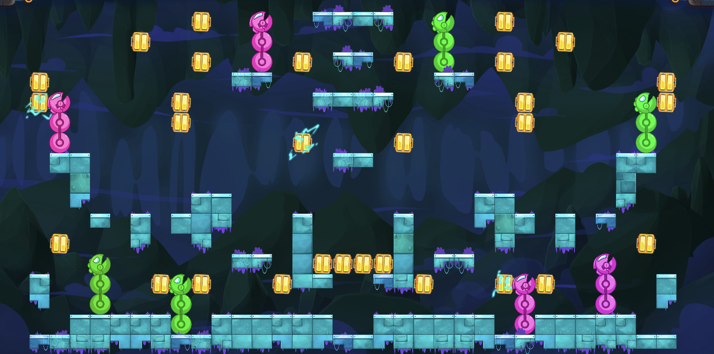

# Winter Challenge 2026 - Exotec Snakebots

# 🎯 Goal
Collect energy to grow your robot snakes and have the longest ones at game end.

[📂 Official Contest Website](https://www.codingame.com/contests/winter-challenge-2026-exotec) 

[📂 Game Rules](docs/Game-Rules) 

## 🧠 Solution Approach

- Iterative improvement using insights from Vertex AI, Claude, and ChatGPT.
- Identified key weaknesses through arena losses, implemented targeted fixes via 3 PRs directly on GitHub web interface.

## 🛠️ Tech Stack

Python 3.11
- No external dependencies
- Grid simulation + BFS pathfinding

## 🚀 How to Run & Test

**Arena deployment:**
- Copy code to official arena → battle other players → analyze losses
- Paste losing code into GitHub web editor → reproduce scenarios → fix weaknesses

**Testing:**
- Arena validation: Replayed 10 lost matches, confirmed win rate improvement
- Integration: Multi-snake coordination

**Validation:** 
- Arena: Replayed 10 lost matches → confirmed through win rate improvement
- Integration: Multi-snake coordination validated via scenario replay

## ⚖️ Design Trade-offs

- **Correctness > Speed**: Full validation before moves (safer)
- **Simple opponent model**: Predicts 1-2 moves ahead (fast, good enough for most races)
- **Risky moves allowed**: Scores high-reward positions despite temporary gravity risk
- **Team coordination**: Greedy team scoring (scales better than full combinatorial search)
- **No runtime ML**: Development used AI tools, but gameplay runs pure algorithms (fits per-turn time limits)
- **Web-only workflow**: All development via GitHub web editor (no local setup required)

## 🏆 Competition Results

🥉 **Bronze League**: [Code Winner](code/1st-version-Bronze)

**Silver League**: [Code top 16% 🥈](code/1st-version-Argent)
